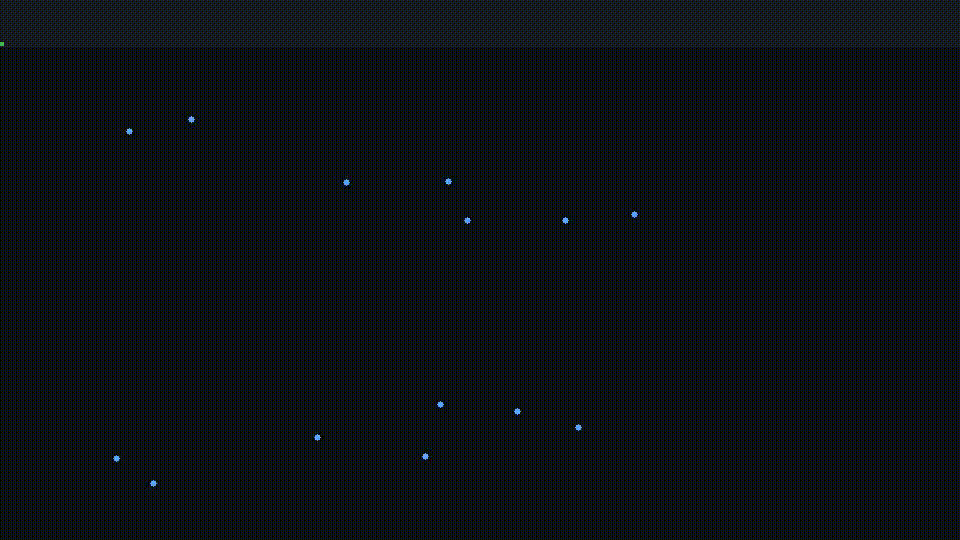

# Arm Swing Visualization



Real-time infrared marker tracking + visualization pipeline using **Qualisys QTM**, a lightweight **ZeroMQ publisher**, and a Python visualization client.

This repo supports two paths:

1. **Live mode**: stream marker data directly from Qualisys Track Manager (QTM).
2. **Demo mode**: replay a bundled C3D file so anyone can run it without lab hardware.

---

## What this repo does

- Connects to QTM and subscribes to real-time 3D marker frames.
- Publishes marker frames over ZeroMQ so multiple clients can subscribe.
- Calibrates arm parameters from streamed marker data.
- Renders a 2D arm swing visualization from infrared marker positions.

---

## Architecture

```text
QTM (live RT stream) OR C3D replay (demo_server.py)
                  |
                  v
         server.py / demo_server.py  (ZeroMQ PUB)
                  |
                  v
      calibrate.py + plot.py + test clients (ZeroMQ SUB)
```

---

## IP addresses (from lab setup)

On the "Harvard Secure" network, both the desktop PC for Qualisys data collection and the computer running the publisher server (`server.py`) must be connected to the network the same way (Wi-Fi or Ethernet), otherwise they may not communicate.

As a rule of thumb: make sure they are on the same subnet and can reach each other.

You may need to modify IPs and/or make them static depending on your setup.

---

## Installation

```bash
python -m venv .venv
source .venv/bin/activate
pip install -r requirements.txt
```

Optional env template:

```bash
cp .env.example .env
```

---

## Quickstart (demo mode, no hardware required)

### 1) Run demo publisher

```bash
python demo_server.py
```

### 2) Calibrate

```bash
python calibrate.py
```

While this runs, you should see marker frame logs in the terminal.
When the subject is in a neutral/rest position (or enough demo frames have passed), stop with `Ctrl+C` to save `calibration.json`.

### 3) Visualize

```bash
python plot.py
```

---

## Usage (live QTM mode)

1. Start publisher and connect to Qualisys stream:

```bash
python server.py
```

2. Run calibration while data is streaming:

```bash
python calibrate.py
```

Wait until the subject has their arms at a resting position, then stop the program. This saves static calibration measurements.

3. Start the real-time client visualization:

```bash
python plot.py
```

---

## Configuration

Environment variables:

- `QTM_IP` (default: `127.0.0.1`)
- `QTM_RT_VERSION` (default: `1.8`)
- `STREAM_FREQUENCY` (default: `40`)
- `PUBLISH_BIND` (default: `tcp://*:5555`)
- `DEMO_C3D_PATH` (default: `data/arm_swing.c3d`)
- `DEMO_FPS` (default: `40`)
- `DEMO_FRAME_STEP` (default: `5`)
- `PUBLISHER_SOCKET` (default: `tcp://127.0.0.1:5555`)

---

## Demo media generation (ffmpeg)

A short demo clip/GIF (shown at top) was generated from the bundled C3D sample.

```bash
python scripts/make_demo_frames.py
ffmpeg -y -framerate 20 -i docs/assets/demo_frames/frame_%04d.ppm -c:v libx264 -pix_fmt yuv420p docs/assets/demo.mp4
ffmpeg -y -i docs/assets/demo.mp4 -vf "fps=15,scale=960:-1:flags=lanczos" docs/assets/demo.gif
```

---

## Troubleshooting

### No frames in client

- Ensure `server.py` or `demo_server.py` is running.
- Verify publisher/subscriber endpoints match (`PUBLISH_BIND` vs `PUBLISHER_SOCKET`).
- Check firewall/network rules.

### Connected to QTM but no marker data

- Confirm QTM is actively streaming 3D markers.
- Verify marker labels/tracking are active.
- Confirm `QTM_IP` and protocol version.

### Visualization offsets look wrong

- Re-run `calibrate.py` from neutral pose.
- Ensure label mapping in `utils/labels.py` matches your marker setup.

---

## Open source readiness notes

- Demo path is included for contributors without hardware.
- Runtime config is environment-driven (no secrets in source).
- Calibration and troubleshooting flow is documented.
- Recommended before public launch: add a `LICENSE` file.
